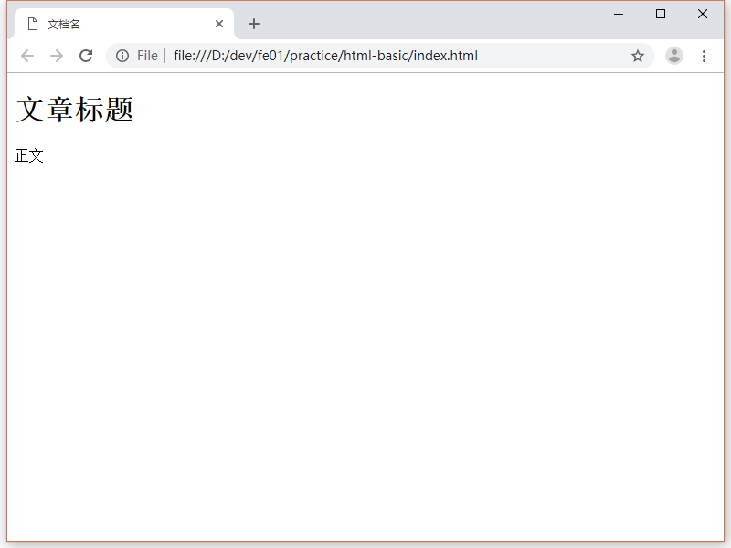

# HTML 基础

HTML 是前端的基础，本节是 HTML 的基础。

在[网站概述](../general-concepts/article.md)章节中，我们了解到了前端的基础是 HTML, CSS, JavaScript。其中 HTML 的作用是**把自己想要展示的内容，以一定的格式表示出来**，也就是定义内容，以及内容的逻辑结构。

- 定义内容包括文字，链接，内容相关的图片，按钮，表单等。至于背景图片，边框颜色，内容字体等通常是为网页的视觉展示服务的，一般会写在 css 中。
- 定义内容的逻辑结构：一般网页的内容是有内在逻辑的，比如一个典型的网页，他有网页头部，网页主体内容，网页底部。头部包含了 logo 和菜单。主体内容包含了文章正文。底部是是一些友情链接，联系方式，版权声明等。之所以叫逻辑结构是为了区分视觉展示，例如头部的菜单，完全可以不在头部，而在侧部，甚至可以虽页面滚动。底部的联系方式也可以显示在任意地方。视觉展示，可以由 CSS 的定义，不依赖特定的逻辑结构。一个良好的逻辑结构不仅可以让开发更清晰，还可以一定程度让你的网站对于搜索引擎更友好，从而排位更高。

## 你的第一个 HTML

这里我们用 VS Code 新建一个 HTML 文件。

1. 新建一个目录，名为 html-basic

2. 用 VS Code 打开这个目录

3. 在 VS Code 中新建名为 index.html 的文件

4. 在文件中输入以下内容

   ```html
   <!DOCTYPE html>
   <html>
       <head>
           <meta charset="UTF-8">
           <title>文档名</title>
       </head>
       <body>
           <h1>文章标题</h1>
           <p>正文</p>
       </body>
   </html>
   ```

5. 按 ctrl + s ( Mac 是 cmd + s ) 或者菜单中保存文件


现在，这个 index.html 就是我们的第一个 HTML 文件啦！

下面用 Chrome 打开 index.html 即可看到展示效果：



## HTML 语法

在上面的例子中可以看到 HTML 文件是由浏览器处理的，浏览器的工作就是根据 HTML 文件展示效果，这个过程称为渲染。HTML 该怎么写呢？

### 定义文档类型

在上面的例子中，第一行是：

```html
<!DOCTYPE html>
```

这一行的作用是定义文档类型，意义是告诉浏览器，以 HTML5 的方式识别内容。历史上有过其他种文档类型，基本已经过时了。因此大家只要记住这个就好。想了解更多请查看链接：https://www.w3.org/QA/2002/04/valid-dtd-list.html

### 元素 (Element)

HTML 文档由元素组成，在上面的例子中，出现的元素有：html, head, body, meta, title, h1, p。用 p 元素举例子

```html
<p>正文</p>
```

P 代表 paragraph 即段落，段落是有开始和结束的，可以看到，这个元素由<p>开始，由</p>结束。但并不是所有的元素都有开始和结束之分的，比如例子中的 meta 元素，meta 代表 metadata 是文档的元数据，因此不需要结束标签。再比如 BR 元素用作换行 (break line)，写法是 &lt;br&gt;，也不需要结束标签。如何知道一个元素是否需要结束标签呢？推荐的地方是 [MDN web docs](https://developer.mozilla.org/en-US/)，这里的文档齐全并且权威，是开发者的好朋友。比如 br 元素的文档：https://developer.mozilla.org/en-US/docs/Web/HTML/Element/br 这里明确说名了不需要结束标签。

另外有的元素还有自己的属性，例子中的 meta：

```html
<meta charset="UTF-8">
```

charset 是属性名，属性的值为 UTF-8，值需要用双引号包含，属性名和属性的值用等号相连。不同的元素有着不同的属性以及值，可以从 MDN 文档中找到答案。

### 树形结构

上文中我们提到了内容有自己的逻辑结构。在 HTML 中，基本的结构是**树形结构**，树由元素组成。在上面的例子中 HTML 的树形结构是：

- 只有1个根元素，元素名为 html
- 根元素有两个**子元素(Child Element)**分别是 head 和 body
- head 和 body 分别有自己的子元素
- 其中 body 的子节点  h1 包含的是文字，文字就不是元素了，它属于h1

树形结构也是有限制的：是否能包含子元素，能包含什么样的子元素都各有区别。例如 html 就只能有 2 个子元素，分别是 head 和 body，而 P 元素可以包含很多种元素。读者可以查看 [MDN 文档说明](https://developer.mozilla.org/en-US/docs/Web/HTML/Element/html) 中的 Permitted content (允许的内容，即允许包含的内容)。

## 总结

本节介绍了 HTML 文档的基本写法，包括标签的写法，以及树形结构，介绍了查文档的地方。但是 HTML 文档很长，需要全看一遍吗？当然不，下一节我们会介绍一些常用的元素，让大家快速上手。