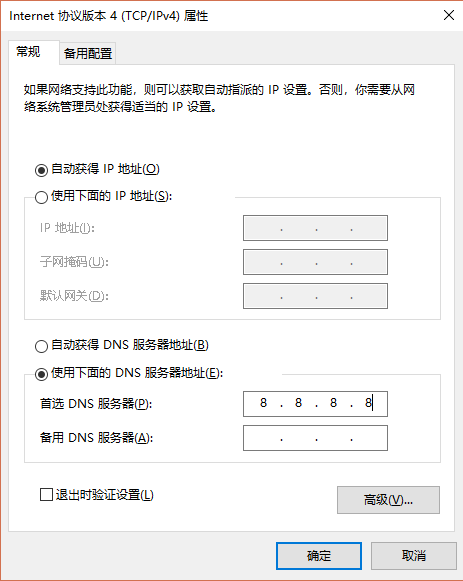
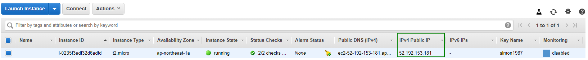

# 给设计师的 Web 前端编程介绍

设计师现在深入各行各业，软件也不例外。但是一般的设计师可以设计出很漂亮的平面设计，UI 设计，网页设计但是却缺少把网页设计转化为网站的能力，特别是在新媒体年代。与之相对的，程序员他不会设计，却能够让网页上线，这么一对比有点不公平的感觉。好的方面是，网页设计入门非常简单，特别是有合适的教程与合适的指导。这篇文站希望能尽量站在设计师的角度，介绍 Web 编程。

## 与平面设计的异同

首先，我们介绍下相对于平面设计的相同不同点。相同点包括：

1. 网页设计仍然是视觉设计。不管怎样，网页是通过肉眼让人获取的（特例是盲人使用屏幕阅读器阅读网页）。因此，线，形状，空间，颜色，材质，字体等设计师熟悉的要素，仍然非常有用。
2. 依然需要作图工具。在比较正式的项目中，在实际代码之前通常会有一个设计稿，而这个设计稿通常是用 PhotoShop 等软件设计出的。网页上需要的图片素材同样经常需要 PhotoShop 处理。因此这个技能同样实用。

不同点包括：

1. 未知的尺寸。在平面设计中，不管是海报，三折页，广告牌，我们知道他的大小。但是在 web 世界，我们不知道最终打开网页的设备是手机还是 pc 还是平板电脑，也不知道他的具体分辨率。通常需要设计一套样式，在不同尺寸都能工作正常，即响应式设计 (responsive design)。
2. 未知的内容。平面设计通常内容是定义好的，不管是图片，文字。网页却经常不一样。想象我们有 4 个人的介绍，通过卡片式设计，4 个卡片依次排成一排。这时候如果有一个人的介绍内容增加或减少，那么 4 个卡片高度就不一致。假设增加 1 人一共 5 人那可能一排就不够展示所有人。是改为幻灯片式切换还是换行，都是要考虑的事情。所以有一种说法我很认同：网页设计并不是设计网页，而是设计网页的模版。
3. 网页不需要考虑材质。平面设计经常是要印刷出来的，要考虑印刷物的材质，装订方法，展示环境等等。
5. 网页可以交互。简单的交互例如网页的加载，超链接，导航菜单。网页的加载越快越好，如果加载慢的话，要考虑是否显示进度条等。超链接访问过的，为访问过的，站内超链接，站外超链接的展示是否要有所区别，点击超链接是否要有反馈。这些都属于交互设计领域，尤其是作为应用平台，例如电商网站，企业软件，SAAS 平台，交互设计尤其重要。
6. 网页可以有多媒体。网页可以嵌入视频，声音。
7. 网页可以有动效。例如淡入淡出效果，页面切换效果等等。
8. (optional) 做网页需要写代码，懂一些技术。你需要会 html, css, javascript，需要懂得一些域名，服务器等知识。

## 学技术的好处

为什么设计师要学做网页呢？当然不是说不学不行，不过通常情况学习做网页下有下面一些理由：

- 更好的和开发沟通。如果你是网页设计师而不写代码，那么你一定要和程序员准确沟通，比如切图给他们，把尺寸数据给他们等等。这时候如果你有一些基础，沟通就会很方便，程序员一定喜欢你。另外，UI 界面技术都是相通的，做 app 做小程序相同的知识同样有用。
- 更好的职业发展。一些设计师的招聘条件上我见过有会 html/css/js 优先的。另外，假设设计师希望转做产品经理，项目经理等等，会这些技能也很有优势。比如想自己创业，就可以独立作出产品原型。当然深入学习写代码成为全干工程师也完全有可能。
- 网页是一种有趣的表达方式。如果会网页设计，那就可以特立独行的展示自己的设计理念，全世界人访问你的网站都可以看到，而不是在花瓣网上传个想象中的网页设计图，也不是微信公众号的一篇文章，只给中国人看。
- 做网页简单。做网页不是高科技，我们科班出生码农上课老师也不教。代码看起来是很多奇怪的单词符号组合起来，令人害怕，其实熟悉之后完全可以一目十行。回忆一下在刚学英语时发的英文课本，是天书一样，一学期结束后再看就简单多了。开始的时候要克服畏惧心理。

## 网站的基本原理

在 coding 之前，我们需要了解一个网站是怎么工作的。我们从浏览器开始。常用的浏览器包括 Chrome，Firefox，IE，Edge 等等。因为 Chrome 是开源的，因此产生了很多的套壳浏览器，比如中国的各种浏览器。

浏览器功能越来越多，越来越复杂，不过主要也是最重要的工作有2个：
1. 根据 url 讲相应的网页下载到机器上
2. 将下载的网页渲染出来

认识下 url：
<div style="display: flex; justify-content: flex-start">
  <span style="display: flex; flex-direction: column; align-items: center; color: #cf2015"><span>①</span><span>https</span></span>
  <span style="display: flex; flex-direction: column; align-items: center;"><span>&nbsp;</span><span>:</span></span>
  <span style="display: flex; flex-direction: column; align-items: center; color: #f17b21"><span>②</span>//</span>
  <span style="display: flex; flex-direction: column; align-items: center; color: #38a41b"><span>③</span>www.example.com</span>
  <span style="display: flex; flex-direction: column; align-items: center; color: #1587cc"><span>④</span>:3000</span>
  <span style="display: flex; flex-direction: column; align-items: center; color: #0b3ecc"><span>⑤</span>/path/resource</span>
  <span style="display: flex; flex-direction: column; align-items: center; color: #9e37cc"><span>⑥</span>?id=123&amp;name=test</span>
  <span style="display: flex; flex-direction: column; align-items: center; color: #f242d4"><span>⑦</span>#section-id</span>
</div>
<ol>
<li style="color: #cf2015">协议 - 定义了如何获取资源</li>
<li style="color: #f17b21">层级URL标记符号 - (为 // ,固定不变)</li>
<li style="color: #38a41b">域名 - 也可以是 IP 地址，例子中是一个二级域名</li>
<li style="color: #1587cc">端口 - 可以省略。如果省略了，HTTP 是 80 端口，HTTPS 是 443 端口。</li>
<li style="color: #0b3ecc">路径 - 希望访问资源的路径</li>
<li style="color: #9e37cc">查询参数 - 以?开始，&amp;分隔，=连接键值(key value)</li>
<li style="color: #f242d4">片段ID - 以 # 开始的字符，一般对应页面中某个元素的 id 属性</li>
</ol>

域名是怎么回事？

我们知道在英特网上，(不严格的说)每台电脑都有一个唯一的 IP，就像每个手机都有自己的号码。通过 IP 就可以去访问机器，当然有可能出现“空号”，即某个 IP 没有人使用，也有可能出现无反馈，即不应答。这个 IP 地址不好记，人们想了个办法，给这些 IP 名字，然后我们记名字就好了。这个名字就是“域名(domain name)”。

谁来分配，管理这些域名呢，是这个叫“ICANN(Internet Corporation for Assigned Names and Numbers)”的非营利机构。只有经过它授权的域名注册管理机构和域名注册商，才能对外界提供顶级域名管理和注册服务。对于我们一般人来说，就通过域名注册商，来购买，使用域名。

现在多了个域名，但是英特网仍然是通过 IP 寻找机器的，所以在打开网站的时候需要多一步操作：把域名转换为 IP，这个操作叫做“域名解析”，提供域名解析的系统，叫域名系统，即 DNS(Domain Name System)。域名系统在哪里设置呢？这个通常是不需要访问互联网的用户设置的，运营商会费配一个 DNS 服务器，我们在上网的时候，就会通过这个服务器查询域名所对应的 IP 地址。当然也可以手动设置，例如 Windows 系统的设置：



域名的拥有着通常通过域名注册商设置域名的 DNS。

例如：笔者在亚马逊购买了服务器，在 GoDaddy 购买了域名，同时在 Godaddy 设置了域名指向的服务器：

1. 亚马逊购买了服务器，IP 为 52.192.153.181

2. GoDaddy 购买了域名 simon1987.com

3. GoDaddy 中设置域名对应的 IP 即 DNS 记录。


这样，对应关系就建立好了，剩下的就是在这台服务器上，运行网站服务了。

所谓网站服务，就是在机器上开一个程序，这个程序一直保持开启，对任何 HTTP(s) 访问，回应相应的内容。所以这台机器称作服务器。机器上的程序称为网页服务器软件(Web Server)。类似于电话客服，对任何打电话过来询问的人给予回复。回应的内容是什么呢？就是网页，图片，CSS，JS 等等资源。而作为一个开发，要做的就是准备好这些网页，图片，CSS，JS 等等资源，给用户访问。

现在可以捋一下浏览网站的基本流程了。
1. 用户打开浏览器软件
2. 用户在浏览器的地址栏中，输入 URL，并访问
3. 浏览器根据 URL，经过域名解析，向相应的服务器发送 HTTP 请求
4. 服务器中的网页服务器软件 (Web Server)，接收到了 HTTP 请求，向用户的浏览器返回 HTML
5. 浏览器获得了 URL 对应的 HTML，渲染并展示在屏幕上

与之对应的，一个典型的 Web 开发者工作的流程是这样：
1. 编辑 HTML/CSS/JavaScript 文件
2. 配置好域名，服务器，以及网页服务器软件 (Web Server)
3. 将编辑好的文件部署到服务器上

## HTML/CSS/JavaScript 是什么
我们已经知道了浏览器就是通过 HTML/CSS/JavaScript 来渲染网页的。那这几个到底什么作用呢？

### HTML (Hypertext Markup Language)

HTML 的职责主要是定义网站的内容，以及结构，一个简单的 HTML 文件的例子：

```html
<!DOCTYPE html>
<html>
    <head>
        <meta charset="UTF-8">
        <title>文档名</title>
    </head>
    <body>
        <h1>文章标题</h1>
        <p>正文</p>
    </body>
</html>
```

浏览器打开后的效果是：


HTML 基本写法，规则只要 1 小时就可以学会，剩下的就是看文档。

### CSS (层叠样式表 Cascading Style Sheets)
CSS 的职责顾名思义，是定义样式(style)的，同样的内容，该用什么样式展示。例如颜色，字体，大小，边框，背景，阴影甚至简单的动画特效，都可以用 CSS 完成。

```css
h1 {
    color: red;
}
```

上面的 CSS 规定了 h1 元素的文字颜色是红色。如果把上面的 CSS 应用到之前 HTML 的例子，用浏览器打开效果如下：


CSS 学习需要的时间相对于 HTML 长一些，如果对样式没有高级酷炫的要求，入门的水平还是很快的。

### JavaScript

HTML 和 CSS 只是信息的展示。如果说浏览器或者 web 能够成为一个应用平台，那还是不够的。还需要能够完成一些逻辑性的工作，例如：在用户输入邮箱的时候，检查邮箱格式是否正确。这时候，就需要一门编程语言，这门语言就是 JavaScript。经常缩写为 JS。

他由 Brendan Eich 最初设计实现。经过标准化(标准化的名字称为 ECMAScript，可以认为和 JavaScript 是一种东西的两种称谓)，以及多个版本的发展，现在 JavaScript 功能十分强大，甚至有了 NodeJS 这样浏览器以外的平台。根据[统计](https://githut.info/)JavaScript 是 Github 上最活跃的语言（2019年2月）。下面是一个简单的 JavaScript 语言的例子。

```javascript
window.alert('hello world')
```

这个例子中，使用了 window 对象(即浏览器提供的一个对象，他代表浏览器窗口)的功能，弹出提示“hello world”。用浏览器打开会弹出对话框，效果如下：


JavaScript 是这三者中相对最难的。学习时间因人而异。这个也是通常意义上的编程语言(Programming Language)。(HTML 是 Markup Language)。熟练以后可以训练自己的逻辑思维，甚至提供一种新的思维方式。

## 入门资料
1. Web 入门
 https://developer.mozilla.org/zh-CN/docs/Learn/Getting_started_with_the_web
2. 权威且详细文档：https://developer.mozilla.org/zh-CN/docs/Web
3. 对不同的专题有不错的文章 https://css-tricks.com/guides/beginner/
4. 编程学习路线图：https://github.com/kamranahmedse/developer-roadmap
5. Google & stackoverflow
6. 敬请期待